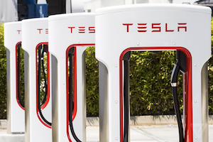

# Code Louisville - January 2021
## Data Science with Python - Tesla Superchargers Project

This notebook will analyze the Tesla Supercharging Network. This is a network of electric vehicle charging sites located throughout the world. These chargers are primarily used by Tesla vehicles. A typical Tesla has a range of 250-350 miles. To travel, you will need to stop and charge. 

A typical Level 2 home charger will take 10-12 hours to completely recharge a car. Obviously this is too long to wait if you are on a trip or vacation. These Superchargers are also known as Level 3 DC fast chargers. They can charge a Tesla from 0-75% in around 20 minutes. This enables Teslas to be more easily driven over long distances.  

There are approximately 1000 sites and 10,000 chargers in the US at the time this readme file was created. More are being installed every month. 

### Questions

* What are the top ten sites by state?
* What are the top ten individual chargers by state?
* What are the top ten states with the the fewest people per charger **the best**?
* How are the sites distributed across the U.S.?
* Compare the output power (150Kw, 250Kw, etc) that determines how long a vehicle has to stay to charge.
* Has the Supercharger network kept up with the production and delivery of new Teslas?
* Are Superchargers distributed equally when factoring population?
* Using a machine learning model, can I predict the size of the Supercharger site based on the features contained int the dataset

### Requirements.txt

There is a **requirements.txt** file in the repo that you should use the load the libraries. I used Jupyter Lab to build the project. It has quite a few packages it needs just for Jupyter Lab. So the requirements.txt file is longer than it should be with Notebooks.

### Cartopy Issues on MacOS
Also I have had many issues trying to get Cartopy to install with the requirements.txt file. It just wont. The typical error is that numpy isn't installed but it clearly is. 

I put the Cartopy at the end of the requirements file, so it would go last. But, there is no guarantee that pip honors the order. So these are the steps that seem to work for me.

* pip install -r requirements.txt
* pip install numpy (it already is but...)
* pip install Cartopy

### Offical Cartopy installation
https://scitools.org.uk/cartopy/docs/latest/installing.html
